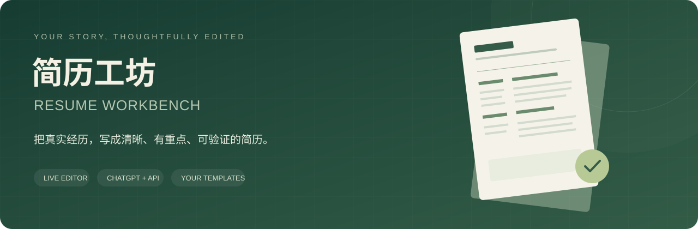
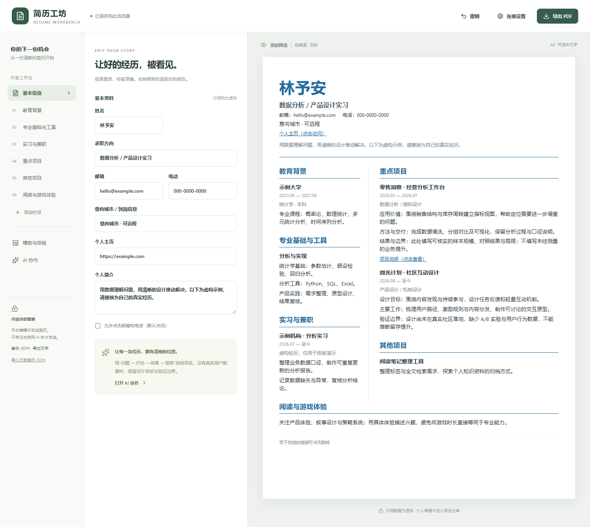
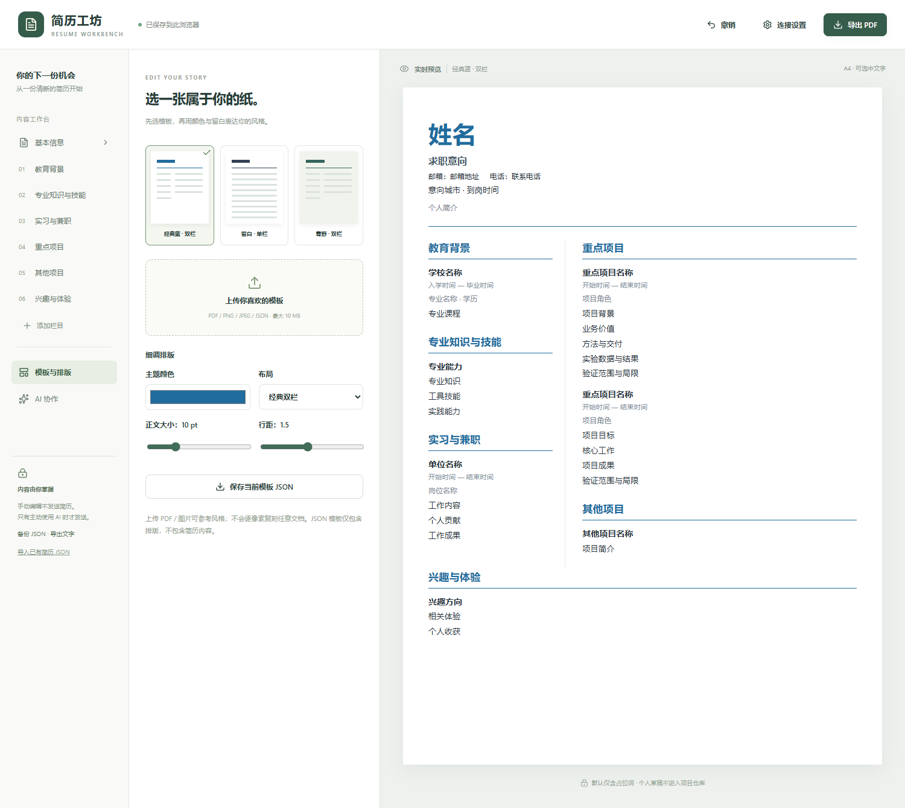

<p align="center"></p>

<!-- BEGIN RIGHTS NOTICE -->
## 版权与使用限制 / Copyright and use restrictions

**保留所有权利。未经著作权人事先书面许可，不得使用、运行、复制、修改或分发本项目受保护的原创内容，包括个人、学习、研究、非商业和商业用途，以及依法需要许可的 AI 使用。Star 不构成授权。**

**All rights reserved. Prior written permission is required to use, run, copy, modify or distribute the project's protected original material, including personal, educational, research, non-commercial and commercial use, and AI use where permission is required by law. A GitHub Star does not grant permission.**

完整条款见 [LICENSE](LICENSE)。第三方内容仍适用其各自许可；此前已授予的许可、法定权利及 GitHub 平台条款项下权利不受影响。本文中的安装、运行及开发说明仅为技术说明，不构成使用授权。

See [LICENSE](LICENSE) for the full terms. Third-party licenses, previously granted permissions, statutory rights and rights under GitHub's Terms of Service remain unaffected. Setup, usage and development instructions are technical documentation, not permission to use the material.

书面授权 / Permission requests: [ilovemiku520@outlook.com](mailto:ilovemiku520@outlook.com)

关注初音未来谢谢喵，ilovemiku520  
Please follow Hatsune Miku, thank you, meow. ilovemiku520
<!-- END RIGHTS NOTICE -->

<p align="center"><strong>把真实经历，写成清晰、有重点、可验证的简历。</strong><br><sub>Write your story. Keep your facts. Own your data.</sub></p>

<p align="center">
  <a href="#quick-start"></a>
  <a href="docs/CHATGPT.md"></a>
  <a href="#templates"></a>
  <a href="docs/PRIVACY.md"></a>
  <a href="LICENSE"></a>
</p>

<p align="center"><strong>简体中文</strong> | <a href="README.en.md">English</a></p>
<p align="center"><a href="#preview">界面预览</a> · <a href="#quick-start">快速开始</a> · <a href="#templates">模板系统</a> · <a href="#ai">AI 协作</a> · <a href="docs/CHATGPT.md">ChatGPT 插件</a> · <a href="docs/DEPLOYMENT.md">部署指南</a></p>

> **使用须经书面许可：** 保留所有权利；Star 不构成授权。完整条款见 [LICENSE](LICENSE)。

## 一份简历，三种协作方式

Resume Workbench 是一个可自托管的在线简历编辑器，也是一套可接入 ChatGPT 的 MCP 插件。它将本次项目实践中反复出现的需求做成通用功能：栏目标签与内容匹配、重点项目分层、业务价值与实验依据并列、设计目标与真实效果分开、链接是否可点击由用户选择。

| 直接编辑 | ChatGPT 中协作 | OpenAI API 优化 |
|---|---|---|
| 浏览器内编辑、保存、撤销与预览 | MCP 工具 + 交互编辑界面 | 自带密钥或管理员配置密钥 |
| 不需要账号或 API Key | 显式同步后继续对话修改 | 先看建议和前后全文，再应用 |
| PDF / Markdown / JSON 导出 | 插件端不额外调用模型 API | 默认隐藏基本信息与项目 URL |

<a id="preview"></a>
## 界面预览



<sub>截图来自本仓库的实际构建。姓名、联系方式、学校、公司和项目经历均使用通用占位词，不包含作者的私人简历、照片或上传文件。</sub>

<a id="quick-start"></a>
## 三步打开工作台

准备 **Node.js 22.13+**。手动编辑、模板切换和导出无需 API Key。

```bash
git clone https://github.com/ilovemiku520/resume-workbench.git
cd resume-workbench
npm ci
npm run build
npm start
```

打开 **http://localhost:4318**。修改后自动保存到当前浏览器；建议定期导出 JSON 备份。

默认只显示“姓名”“学校名称”“项目名称”“业务价值”等通用占位词，日期、经历与成果由你填写，链接默认留空。三套版式共用同一内容结构。已有浏览器草稿会保留；需要重新开始时，可导入[占位简历 JSON](examples/placeholder-resume.json)。

1. **写内容**：填写资料、增加栏目与条目，用“主栏 / 侧栏 / 通栏”分配重点。
2. **选模板**：选择默认模板，或上传参考文件并调整颜色、字号与行距。
3. **做交付**：点击“导出 PDF”，在打印窗口选择保存为 PDF；也可导出 Markdown 与完整 JSON。

PDF 保留项目链接；邮箱、电话默认只显示普通文字。建议打印时使用 A4，关闭浏览器自带的页眉页脚，检查分页与背景颜色设置。长简历自动分页，不保证所有内容都能压到一页。

<a id="templates"></a>
## 模板不只是一张截图

| 模板 | 设计 | 适合表达 |
|---|---|---|
| **经典蓝** | 清晰的蓝色标题与双栏布局 | 重点项目 + 教育及工具背景 |
| **留白** | 简洁单栏、横向标题与日期 | 按经历顺序展开叙述 |
| **青野** | 绿色主题、侧栏信息块 | 产品、策划及跨领域经历 |



支持上传 **PDF / PNG / JPEG / JSON**：

- **JSON**：直接应用受校验的排版参数，可导出复用；不执行任意 HTML、CSS 或脚本。[示例模板](examples/classic-blue.template.json)
- **PDF / 图片**：在本页显示第一张/第一页参考；可手动调整，或点击“AI 提取排版风格”推断布局与配色。不会复制参考里的个人信息，也不承诺逐像素还原任意版式。
- 参考图只保留在当前页面内存中；只有主动点击 AI 分析时才发送给当前服务器及 OpenAI。**参考图原本包含的个人信息也会随图片发送**，请先使用空白或脱敏模板。

<a id="ai"></a>
## 优化表达，保留事实

**独立网页**：点击“连接设置”输入自己的 OpenAI API Key 和模型；密钥仅在当前页面内存中保存，刷新即清除。请求通过当前站点后端发送到 OpenAI，只在自己部署或信任的站点输入密钥。

**管理员密钥**：将 `.env.example` 复制为 `.env`，填写 `OPENAI_API_KEY`，并同时设置随机的 `APP_ACCESS_TOKEN`。未设置访问令牌时，服务拒绝使用管理员密钥。用户在连接设置中输入访问令牌后才能调用。

**ChatGPT 插件**：部署 HTTPS MCP 服务后，按[连接指南](docs/CHATGPT.md)添加 `/mcp`。在对话中调用 `render_resume` 打开编辑器，手动编辑后点击“同步”或“让 ChatGPT 修改”。这条路径使用 ChatGPT 对话本身的模型，不需要在插件里再填 API Key。

| 保护机制 | 实际行为 |
|---|---|
| 可审阅的修改 | 展示建议稿、变化说明和前后全文；确认应用后才覆盖，可撤销 |
| 不覆盖新编辑 | 生成期间原稿发生变化时，拒绝套用旧建议 |
| 证据边界 | API 不允许模型将原型标记升级为已验证，也不允许新增外部项目 URL |
| 联系信息处理 | 默认隐藏基本信息字段及相同文字、移除项目 URL；应用建议时恢复原值 |
| 不虚构量化结果 | 提示模型保留实验边界、将缺失信息列为问题；使用者仍需核实真实性 |

默认 API 模型为可配置的 `gpt-5-mini`，需要具备 Responses API、图片输入和 Structured Outputs 权限。ChatGPT 订阅与 API 额度分别由对应服务管理。项目本身不提供免费模型额度。

## 数据与边界

- 普通网页草稿保存在 **localStorage**，不加密；浏览器使用者和同源脚本可访问。共享电脑使用后请清除站点数据。
- ChatGPT 内嵌编辑器不使用本站草稿存储；明确同步后的内容属于当前对话，受 ChatGPT 的数据设置管理。
- 后端无简历数据库、不记录请求正文、不保存上传文件。仍需检查反向代理、托管平台与模型服务各自的日志政策。[完整隐私说明](docs/PRIVACY.md)
- 没有真实付费 API Key 时，测试使用模拟响应；MCP 与浏览器功能可独立测试。源码发布不等于已在 ChatGPT 插件目录上架。

## 开发与验证

```bash
npm run check       # TypeScript、生产构建、核心与协议测试
npx playwright install chromium
npm run test:e2e    # 编辑、模板、PDF 参考导入、隐私与 AI 建议流程
npm run dev        # 前端开发服务 5178，后端 4318
```

后端修改后重新执行 `npm run build` 并重启；前端开发时支持热更新。测试覆盖输入校验、危险链接、联系人隐藏、证据状态保护、MCP HTTP/内存通信、管理员密钥访问控制、草稿持久化及应用/撤销建议。API 协议测试使用模拟提供方，不能替代真实账号的可用性测试。

```text
src/         网页编辑器与 MCP 交互界面
shared/      简历数据结构、模板、校验和导出
server/      OpenAI API 代理、HTTP / stdio MCP 服务
skills/      插件的简历编辑工作流
examples/    仅含通用占位词的空白简历与版式模板
docs/        接入、部署、隐私和贡献说明
tests/       核心、协议与浏览器验证
```

## 文档导航

| 想做什么 | 从这里开始 |
|---|---|
| 在 ChatGPT / Codex 中连接 | [插件接入](docs/CHATGPT.md) |
| 部署自己的在线服务 | [部署与运行](docs/DEPLOYMENT.md) |
| 理解数据发送与保存范围 | [隐私说明](docs/PRIVACY.md) |
| 添加模板、反馈问题、参与开发 | [贡献指南](CONTRIBUTING.md) |
| 核对官方协议 | [OpenAI 插件文档](https://developers.openai.com/plugins/quickstart) · [MCP UI](https://developers.openai.com/plugins/build/chatgpt-ui) · [Structured Outputs](https://developers.openai.com/api/docs/guides/structured-outputs) |

<p align="center"><sub>关注初音未来谢谢喵，ilovemiku520 · Please follow Hatsune Miku, thank you meow.</sub></p>
